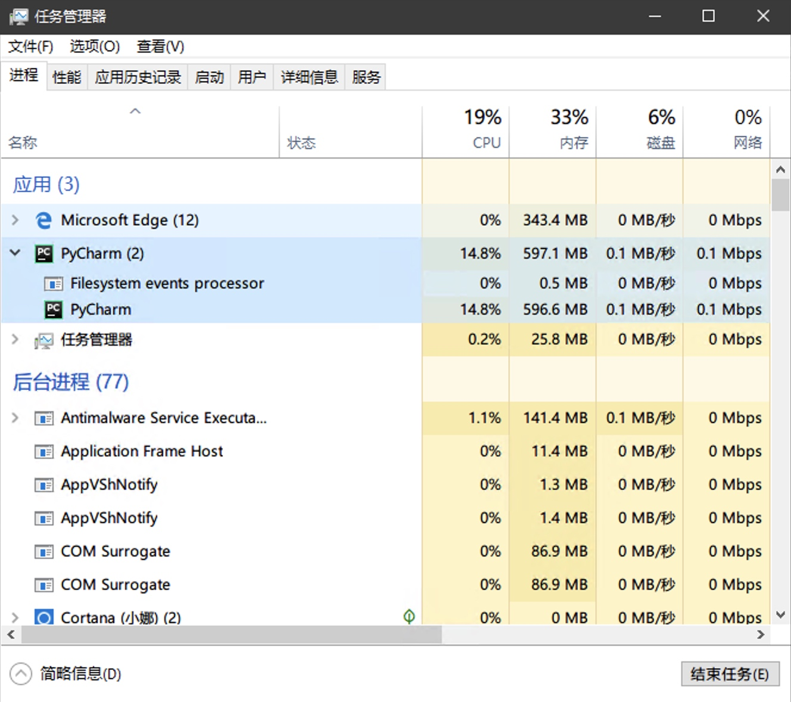
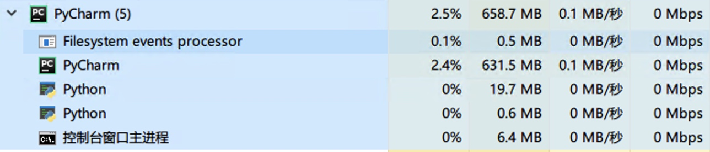
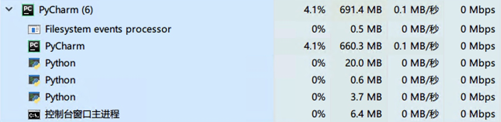
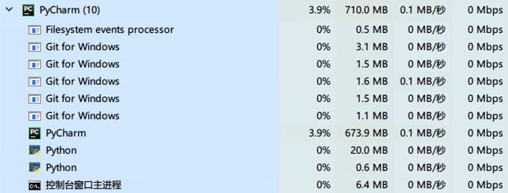
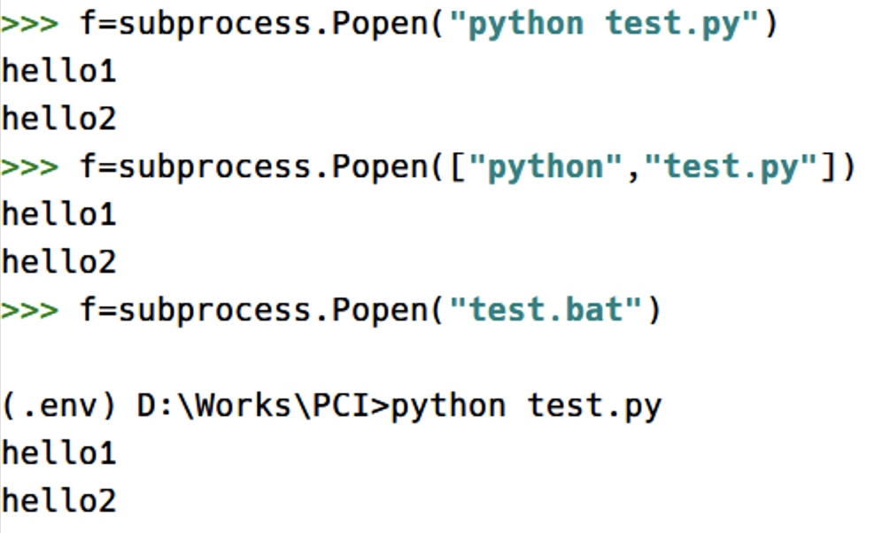
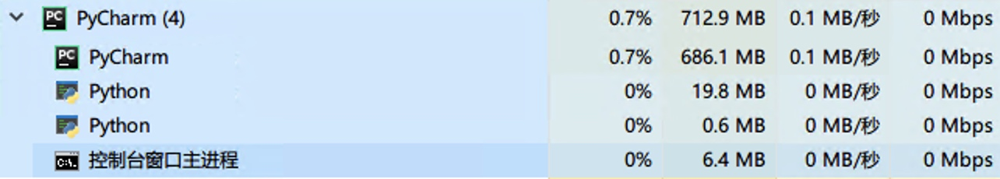
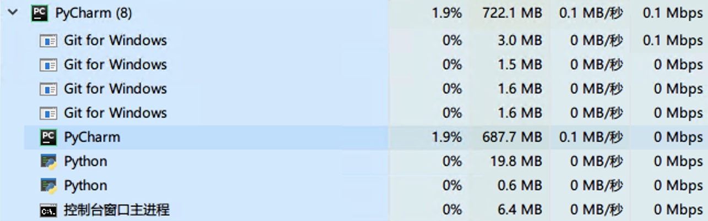
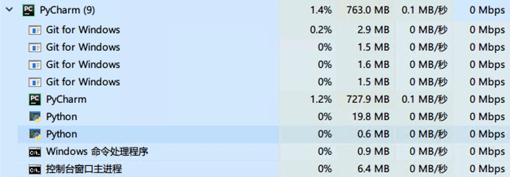

最近在做一个 PCI 的项目，是为办公室的服务器写的一个简单的持续集成功能（我也不知道为什么不用现成的），在没有规定语言的前提下，我优先选择了 python。

用到持续集成，就免不了和 Git 打交道，这里面涉及到了 Git clone, Git pull, 获取最新的 commit 等操作。怎样在 python 中执行 Git 的相关操作呢？最终我选择了 subprocess.Popen，因为他的可操作性更强，使用更加灵活。

<!-- more -->

## 什么是 Popen

官方的解释是

> 在一个新的进程中执行子程序。在 POSIX，此类使用类似于 os.execvp()的行为来执行子程序。在 Windows，此类使用了 Windows CreateProcess() 函数。

那么什么是“在一个新的进程中执行子程序”呢？我们通过下面这个例子说明一下。

1. 在我刚打开 PyCharm 时，可以在 Windows 的任务管理器里面看到 PyCharm 共有两个子进程。

   

2. 当我打开 PyCharm 的 Python Console 以进入 python 的交互模式时，可以看到 PyCharm 进程下又增加了三个子进程。

   

3. 也就是说，在执行 subprocess.Popen 之前，PyCharm 中共有五个子进程，这是前提。接下来，我们在 PyCharm 中新建一个 test.py。

   ```python
   # code in test.py
   import time

   print("this is the first message")
   time.sleep(10)
   print("this is the second message")
   ```

4. 之后，我们在 Python Console 中依次执行以下命令。

   ```python
   >>> import subprocess
   >>> f = subprocess.Popen("python test.py")
   ```

   在 time.sleep 的这十秒内，我们乘机再看一下任务管理器，可以发现 PyCharm 进程下面又多了一个 python 的子进程。

   

5. 同理，我们再尝试一下 Git 的相关命令。

   ```python
   >>> f = subprocess.Popen("git clone https://github.com/taujiong/PCI.git c:/PCI")
   ```

   再次查看任务管理器，可以发现 PyCharm 进程下面又多了五个 Git for Windows 子进程。在 clone 完成之后，在指定的位置就可以看到 PCI 仓库已经存在了，此时这五个子进程就会消失。

   

通过上面的这个例子，我们知道：**subprocess.Popen 所做的事情就是调用系统的接口来创建我们指定的进程以完成预期的任务**

## Popen 的常用参数

### args

> args should be a sequence of program arguments or else a single string or path-like object. By default, the program to execute is the first item in args if args is a sequence. If args is a string, the interpretation is platform-dependent and described below. See the shell and executable arguments for additional differences from the default behavior. Unless otherwise stated, it is recommended to pass args as a sequence.

可见，args 参数接受三种形式的值。在没有特殊说明的情况下，推荐使用第一种。

- 程序参数的序列（以 list 的形式）
- 字符串
- （可执行文件的）路径

也就是说，以下三种形式的执行效果是相同的。

```python
f = subprocess.Popen("python test.py")
f = subprocess.Popen(["python", "test.py"])
f = subprocess.Popen("test.bat")

# code in test.bat
# python test.py
```

值得注意的一点是，前两种方式的输出形式与第三种是有一点不同的。



### shell

#### What

> 参数 shell （默认为 False）指定是否使用 shell 执行程序。如果 shell 为 True，更推荐将 args 作为字符串传递而非序列。
>
> 在 POSIX，当 shell=True， shell 默认为 /bin/sh。如果 args 是一个字符串，此字符串指定将通过 shell 执行的命令。这意味着字符串的格式必须和在命令提示符中所输入的完全相同。这包括，例如，引号和反斜杠转义包含空格的文件名。如果 args 是一个序列，第一项指定了命令，另外的项目将作为传递给 shell （而非命令） 的参数对待。
>
> 在 Windows，使用 shell=True，环境变量 COMSPEC 指定了默认 shell。在 Windows 你唯一需要指定 shell=True 的情况是你想要执行内置在 shell 中的命令（例如 dir 或者 copy）。在运行一个批处理文件或者基于控制台的可执行文件时，不需要 shell=True。

我们还是通过一个例子来看一下效果。

1. 老规矩，这是什么都没干之前，PyCharm 进程下面的子进程。（因为中间重启了电脑，所以启动 PyCharm 时进程发生了变化）

   

2. 然后是不带 shell 参数时执行 Popen 函数。

   ```python
   >>> import subprocess
   >>> f = subprocess.Popen("git clone https://github.com/taujiong/PCI.git c:/PCI")
   ```

   此时，进程图如下：

   

3. 最后是带 shell 参数时执行 Popen 函数。

   ```python
   f = subprocess.Popen("git clone https://github.com/taujiong/PCI.git c:/PCI", shell=True)
   ```

   此时，进程图如下：

   

可以发现，加上 shell 参数，会额外增加一个 Windows 命令处理程序的进程，通过该进程来调用 Git 进程。也就是说，

不带 shell：PyCharm -> python -> Git

带 shell：PyCharm -> python -> cmd -> Git

#### Why

那么，我们什么时候需要 shell=True 呢？

```python
>>> import subprocess
>>> f = subprocess.Popen("echo hello")
Traceback (most recent call last):
  File "<input>", line 1, in <module>
  File "C:\Users\tauji\AppData\Local\Continuum\miniconda3\lib\subprocess.py", line 775, in __init__
    restore_signals, start_new_session)
  File "C:\Users\tauji\AppData\Local\Continuum\miniconda3\lib\subprocess.py", line 1178, in _execute_child
    startupinfo)FileNotFoundError: [WinError 2] 系统找不到指定的文件。
>>> f = subprocess.Popen("echo hello", shell=True)
hello
```

可以发现，有很多命令是只在 cmd 中才能使用的。当然，更多的情况可以参考 [stackoverflow](https://stackoverflow.com/questions/3172470/actual-meaning-of-shell-true-in-subprocess) 上的讨论。

也就是说，**当你需要使用 shell 中特有的命令时，需要加上 shell=True**。

### stdin, stdout, stderr

> stdin, stdout 和 stderr 分别指定被运行的程序的标准输入、输出和标准错误的文件句柄。合法的值有 PIPE ， DEVNULL ， 一个存在的文件描述符（一个正整数），一个存在的 文件对象 以及 None。 PIPE 表示应创建一个新的对子进程的管道。 DEVNULL 表示使用特殊的 os.devnull 文件。使用默认的 None，则不进行成定向；子进程的文件流将继承自父进程。另外， stderr 可设为 STDOUT，表示应用程序的标准错误数据应和标准输出一同捕获。

当不使用这些参数的时候，python 默认会将子进程的 stdout，stderr 输出到当前的 python 窗口。而使用这些参数时，python 会将输出的内容重定向到指定的位置，这里最常用的应该是 PIPE。

```python
>>> import subprocess
>>> f = subprocess.Popen("echo hello",shell=True)
hello
>>> f.stdout.read()Traceback (most recent call last):
  File "<input>", line 1, in <module>
AttributeError: 'NoneType' object has no attribute 'read'

>>> f = subprocess.Popen("echo hello",shell=True, stdout=subprocess.PIPE, stderr=subprocess.PIPE)
>>> f.stdout.read()
b'hello\r\n'
```

可以发现，当指定了 stdout, stderr 之后，程序输出的内容并不会直接呈现在 python 窗口中了，而是会被保存在 stdout 的属性中。

如果程序出错则是保存在 stderr 中。下面的例子里，我把 `echo` 错误地写成了 `ech` ，可以发现输出被保存到了 stderr 中。

```python
>>> f=subprocess.Popen("ech hello",shell=True, stdout=subprocess.PIPE, stderr=subprocess.PIPE)
>>> f.stdout.read()
b''
>>> f.stderr.read()
b"'ech' \xb2\xbb\xca\xc7\xc4\xda\xb2\xbf\xbb\xf2\xcd\xe2\xb2\xbf\xc3\xfc\xc1\xee\xa3\xac\xd2\xb2\xb2\xbb\xca\xc7\xbf\xc9\xd4\xcb\xd0\xd0\xb5\xc4\xb3\xcc\xd0\xf2\r\n\xbb\xf2\xc5\xfa\xb4\xa6\xc0\xed\xce\xc4\xbc\xfe\xa1\xa3\r\n"
```

### encoding or text

可以发现，上面的输出怎么都是以 byte 的形式，这样可读性太差了吧。是的，我们可以通过 encoding 参数将其 decode 为文字，或者使用 text=True。

```python
>>> import subprocess
>>> f=subprocess.Popen("echo hello",shell=True, stdout=subprocess.PIPE, stderr=subprocess.PIPE)
>>> f.stdout.read()
b'hello\r\n'
>>> f=subprocess.Popen("echo hello",shell=True, encoding="utf8",stdout=subprocess.PIPE, stderr=subprocess.PIPE)
>>> f.stdout.read()
'hello\n'
>>> f=subprocess.Popen("echo hello",shell=True, text=True, stdout=subprocess.PIPE, stderr=subprocess.PIPE)
>>> f.stdout.read()
'hello\n'
```

值得一提的是，使用 text=True 可以让我们避免选择编码格式的麻烦。

```python
>>> import subprocess
>>> f=subprocess.Popen("echo 你好",shell=True, encoding="utf8",stdout=subprocess.PIPE, stderr=subprocess.PIPE)
>>> f.stdout.read()Traceback (most recent call last):
  File "<input>", line 1, in <module>
  File "C:\Users\tauji\AppData\Local\Continuum\miniconda3\lib\codecs.py", line 322, in decode
    (result, consumed) = self._buffer_decode(data, self.errors, final)
UnicodeDecodeError: 'utf-8' codec can't decode byte 0xc4 in position 0: invalid continuation byte
>>> f=subprocess.Popen("echo 你好",shell=True, text=True, stdout=subprocess.PIPE, stderr=subprocess.PIPE)
>>> f.stdout.read()
'你好 \n'
```

### cwd

> If cwd is not None, the function changes the working directory to cwd before executing the child. cwd can be a string, bytes or path-like object. In particular, the function looks for executable (or for the first item in args) relative to cwd if the executable path is a relative path.

在我写 PCI 项目时，使用到 cwd 参数的一个典型场景就是使用 `git log -n1` 来获取仓库最新的一次 commit 的 id。由于不同的仓库保存在不同的路径，所以使用 cwd 参数远远优于 os.chdir()。

```python
>>> import subprocess
>>> f = subprocess.Popen("git log -n1",shell=True, text=True, cwd="/Users/taujiong/Projects/PCI",stdout=subprocess.PIPE)
>>> print(f.stdout.read())
commit 80b8d372dff5a4c71cbc29ca9e395c6cd5f6e7c2
Author: taujiong <taujiong@outlook.com>
Date:   Fri Nov 1 13:08:44 2019 +0800

    在服务器端使用 socketserver 代替 socket
```

值得注意的一点是，cwd 需要传入一个绝对路径。例如，在 Linux 或者 Mac 中，使用 `cwd=~/Projects/PCI` 是会报错的。

```python
FileNotFoundError: [Errno 2] No such file or directory: '~/Projects/PCI': '~/Projects/PCI'
```

### env

> 如果 env 不是 None, 它必须是一个字典， 为新的进程设置环境变量; 它用于替换继承的当前进程的环境的默认行为。 它将直接被传递给 Popen.

env 参数可以为子进程设置特殊的环境变量，这在我的项目中暂时没有用到，但是不得不承认这也是一个常用的参数。

```python
>>> import subprocess
>>> f = subprocess.Popen("echo hello, $name, $new_env", shell=True, env={"new_env": "this is a new env variable defined by user", "name": "taujiong"})
hello, taujiong, this is a new env variable defined by user
```

正如文档里面说的，env 参数的值必须是一个字典类型。设置了 env 参数之后，不仅可以在命令中使用，也可以在 bat 或者 sh 脚本中使用。

注意，示例代码中环境变量的写法是 unix 系统的写法，在 Windows 环境下你应该使用 `%name%` 来代替 `$name` 。

## communicate 方法

之前一直没有提的一点是，subprocess.Popen 的使用非常类似于文件的 open。这种调用方式是通过管道的方式来实现，函数返回一个 file-like 的对象，所以我们可以像操作文件那样操作 subprocess.Popen。比如说对 subprocess.Popen 使用 with 上下文管理，对 f.stdout 使用 read, readline, readlines 等操作。

有的时候，我们需要在子进程里面实现一些输入，子进程才能进行下一步动作，此时我们需要 communicate() 方法。

```python
>>> import subprocess
>>> f = subprocess.Popen("python test.py", shell=True, stdin=subprocess.PIPE)
what is your name?
>>> f.communicate("taujiong".encode("utf8"))
hello, taujiong
(None, None)

# code in test.py
name = input("what is your name?")
print(f"hello, {name}")
```

在 test.py 里，我们使用了 `name = input("what is your name?")` 来接收用户的输入，同时在 Popen 中设置了 stdin 参数为一个管道。此时，我们就可以使用 communicate 方法来将输入传输到子进程之中了。

注意到，communicate 方法返回两个值，文档里面说到这两个值分别为 stdout 以及 stderr。当你在 Popen 参数中设置了二者为 PIPE 时，就可以返回相应的结果了，否则将会像上例中那样显示两个 None。

```python
>>> f = subprocess.Popen("python test.py", shell=True, stdin=subprocess.PIPE, stdout=subprocess.PIPE, stderr=subprocess.PIPE)
>>> out, err = f.communicate("taujiong".encode("utf8"))
>>> out.decode("utf8")
"what is your name?\nhello, taujiong\n">>> err.decode("utf8")''
```

## returncode 属性

对于一个进程来说，在其结束时往往会返回一个 exit code，通常情况下，code 为 0 表示一切正常，否则就是出现错误。

在 Popen 中，同样也有 returncode 来返回子程序的 exit code。不过这个值必须要在 communicate 方法之后才能获取到。

```python
>>> import subprocess
>>> f = subprocess.Popen("echo Hello", shell=True)
Hello
>>> f.returncode  # 此处没有任何返回值
>>> f.communicate()(None, None)
>>> f.returncode
0
```

## 总结

上面的所有内容都是我在写 PCI 项目时所需要用到的常用参数，我觉得对于大部分普通项目来说已经够用了。在之前查阅相关资料时，还看到了包括子程序死锁等高级问题，我还没有遇到，所以暂且按下不表。

最后以一段代码来总结一下这些内容在我程序中的体现吧。

```python
import subprocess

f = subprocess.Popen("git log -n1",
                     text=True,
                     shell=True,
                     cwd="Users/taujiong/Projects/PCI",
                     stdout=subprocess.PIPE,
                     stderr=subprocess.PIPE)
out, err = f.communicate()
if f.returncode:
    return err
else:
    msgs = out.split("\n")
    commit = msgs[0].split(" ")[-1]
    return commit
```
